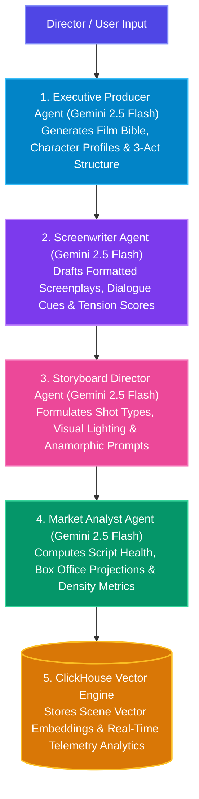

# 🎬 01. CineAgent Studio — Project Overview

> **CineAgent Studio** is an autonomous multi-agent film production suite powered by **Google Gemini Enterprise** and **ClickHouse Vector Analytics**. Built for the *Agentic Cinema: The Blockbuster Hackathon*.

---

## 💡 Executive Summary

Traditional film pre-production requires months of brainstorming, screenplay drafts, storyboard creation, and script pacing analysis across separate teams. 

**CineAgent Studio** automates this entire pipeline into a single, cohesive workflow. By taking a simple movie premise from the user (e.g. genre, tone, logline), an autonomous crew of specialized AI agents collaborates in sequence to generate:

1. **A Complete Film Bible**: Title, logline, target demographics, character profiles, and 3-act narrative arc.
2. **Formatted Screenplay Scenes**: Professional script formatting with sluglines, scene action descriptions, character emotional cues, and dialogue lines.
3. **Multi-Modal Visual Storyboards**: Production shot compositions, anamorphic lens specifications, visual style guidelines, and AI image prompts.
4. **Box Office & Pacing Analytics**: Real-time dramatic tension curves, dialogue-to-action density ratios, and box office revenue projections.
5. **ClickHouse Vector Database Indexing**: Storing scene embeddings in a high-performance vector column store for instant semantic searching by plot point, emotion, or tension level.

---

## 🤖 The Autonomous AI Film Crew

CineAgent Studio operates on a **chained multi-agent architecture**, where each agent plays a distinct role in the film production hierarchy:

### 1. Executive Producer Agent
- **Responsibilities**: Sets the overall creative direction.
- **Outputs**: High-concept logline, target demographic analysis, 3 key character archetypes (Protagonist, Deuteragonist, Antagonist), and a structured 3-act narrative outline.

### 2. Screenwriter Agent
- **Responsibilities**: Transforms the act outline into formatted screenplay scenes.
- **Outputs**: Scene sluglines (e.g., `INT. ORBITAL STATION - NIGHT`), action descriptions, emotional dialogue lines, dramatic tension scores (1.0 to 10.0 scale), and pacing tags (`SETUP`, `SUSPENSE`, `CLIMAX`, `RESOLVE`).

### 3. Storyboard Director Agent
- **Responsibilities**: Translates script scenes into visual shot composition guidelines.
- **Outputs**: Lens specifications (Anamorphic, Close-up, Wide), lighting instructions, color palette choices, and AI image generation prompts.

### 4. Market Analyst Agent
- **Responsibilities**: Evaluates commercial potential and structural integrity.
- **Outputs**: Estimated budget range, worldwide box office forecast, script health score, dialogue-to-action ratio, and greenlight recommendation.

### 5. ClickHouse Vector Engine
- **Responsibilities**: High-speed indexing, semantic similarity searching, and real-time telemetry monitoring.
- **Outputs**: Vector embeddings array storage, cosine similarity search results, script tension curve data for real-time charting.

---

## 🚀 Key Features & Value Proposition

- **End-to-End Automation**: Generates full production assets from a single text prompt in seconds.
- **Dual Database Strategy**: Seamlessly connects to **ClickHouse Cloud** for production or automatically falls back to an **Embedded ClickHouse Engine** for offline development.
- **Interactive Web Interface**: A sleek, dark-mode darkroom UI featuring interactive tabbed views for Screenplay, Storyboards, Vector Search, and Real-time Telemetry Analytics.
- **Enterprise-Grade AI**: Powered by Google's latest `@google/genai` Python SDK running on Vertex AI / Gemini Enterprise infrastructure.
