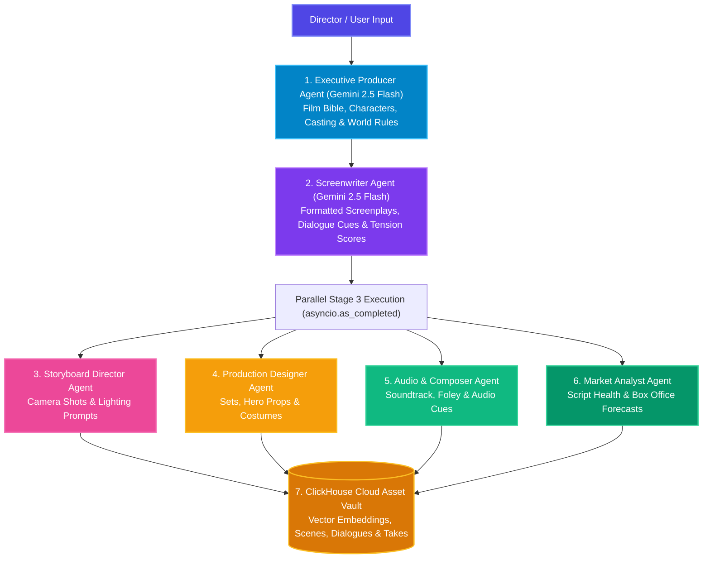

# 🎬 01. CineAgent Studio — Project Overview

> **CineAgent Studio** is an autonomous multi-agent film production suite powered by **Google Gemini Enterprise**, **ClickHouse Cloud Vector Engine**, and **Google Cloud Log Analytics**. Built for the *Agentic Cinema: The Blockbuster Hackathon*.

---

## 💡 Executive Summary

Traditional film pre-production requires months of brainstorming, screenplay drafts, storyboard creation, vocal casting, and script pacing analysis across separate teams. 

**CineAgent Studio** automates this entire pipeline into a single, cohesive, streaming workflow. By taking a simple movie premise from the user (e.g. genre, tone, logline) or an uploaded screenplay document for RAG grounding, an autonomous crew of specialized AI agents collaborates in real time to generate:

1. **A Complete Film Bible**: Title, logline, target demographics, character profiles with costume specs & voice assignments, and 3-act narrative arc.
2. **Formatted Screenplay Scenes**: Professional script formatting with sluglines, scene action descriptions, character emotional cues, and dialogue lines with interactive Director's Cut revisions.
3. **Multi-Modal Visual Storyboards**: Production shot compositions, lens specifications, and real-time concept frames.
4. **Production Design & Audio Soundscapes**: Detailed set architecture, key hero prop designs, costume notes, orchestral soundtrack themes, and environmental foley cues.
5. **Actor Voice Vault & Speech Synthesis**: High-quality synthetic voice synthesis and persistent casting library across global accents.
6. **Box Office & Pacing Analytics**: Real-time dramatic tension curves, dialogue-to-action density ratios, and box office revenue projections.
7. **ClickHouse Cloud Database Indexing**: Complete persistence across 8 relational/vector tables (`projects`, `scenes`, `dialogues`, `storyboards`, `production_design`, `audio_post`, `generated_images`, `actor_voice_vault`, `dialogue_audio`).
8. **GCP Log Analytics & Model Thinking Observability**: Process-wide structured telemetry capturing token counts, model thinking tokens, and distributed request tracing.

---

## 🤖 The Autonomous AI Film Crew & Parallel Execution

CineAgent Studio operates on a **hybrid sequential & parallel multi-agent architecture**:

### 1. Executive Producer Agent
- **Responsibilities**: Sets the overall creative vision and narrative universe.
- **Outputs**: High-concept logline, target demographic analysis, casting profiles (archetypes, costume designs, voice models), and 3-act narrative framework.

### 2. Screenwriter Agent
- **Responsibilities**: Transforms act outlines into formatted screenplay scenes.
- **Outputs**: Industry-standard sluglines (e.g., `INT. ORBITAL STATION - NIGHT`), action descriptions, emotional dialogue lines, dramatic tension scores (1.0 to 10.0 scale), and pacing tags (`SETUP`, `SUSPENSE`, `CLIMAX`, `RESOLVE`).

### 3. Storyboard Director Agent
- **Responsibilities**: Translates script scenes into visual shot composition guidelines.
- **Outputs**: Lens specifications (Anamorphic, Close-up, Wide), lighting instructions, color palette choices, and AI image generation prompts.

### 4. Production Designer Agent
- **Responsibilities**: Builds physical sets, hero props, and costume designs.
- **Outputs**: Architectural set layouts, material palettes, hero prop specifications, and character wardrobe notes.

### 5. Audio Department Agent
- **Responsibilities**: Composes the auditory landscape and musical cues.
- **Outputs**: Soundtrack themes, tempo/instrumentation directions, environmental foley textures, and dramatic audio cues.

### 6. Market Analyst Agent
- **Responsibilities**: Evaluates commercial viability and narrative pacing.
- **Outputs**: Estimated budget range, worldwide box office forecast, script health score, dialogue-to-action ratio, and greenlight recommendation.

### 7. ClickHouse Cloud Asset Vault & Vector Engine
- **Responsibilities**: High-speed indexing, semantic similarity searching, and persistent project storage across 8 tables.
- **Outputs**: 768-dimensional vector embeddings array storage, cosine similarity search results, and script tension curve telemetry.

---

## 🚀 Key Features & Value Proposition

- **Progressive Real-Time Streaming (SSE)**: Streams film bibles within ~3 seconds and yields downstream department results as each completes.
- **Parallel Department Execution**: Cuts total generation latency by >50% by running Storyboards, Production Design, Audio, and Analytics concurrently.
- **Complete ClickHouse Cloud Persistence**: Automatically indexes all 8 production tables so projects and audio takes are never lost.
- **Actor Voice Vault**: Browse, audition, and synthesize character voices across global accents with automatic voice registration.
- **Enterprise-Grade AI & Observability**: Powered by `@google/genai` on Vertex AI with dual-dispatch Google Cloud Logging and BigQuery Log Analytics.
