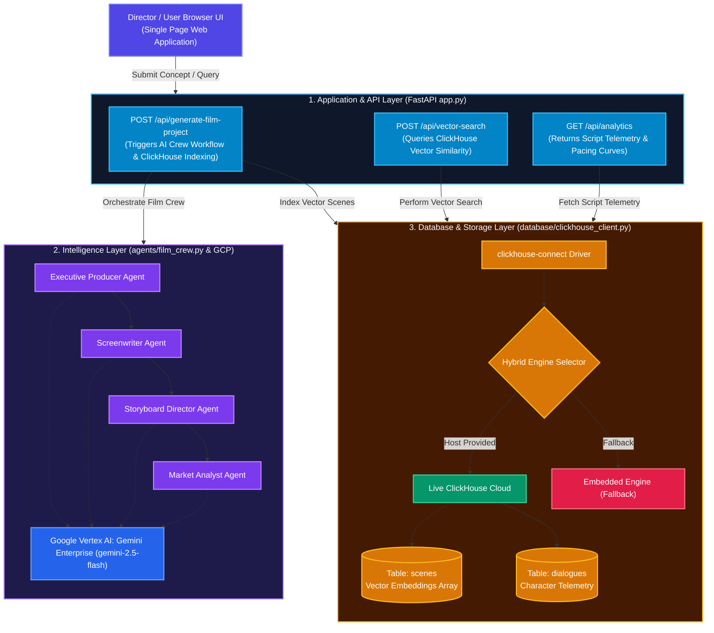
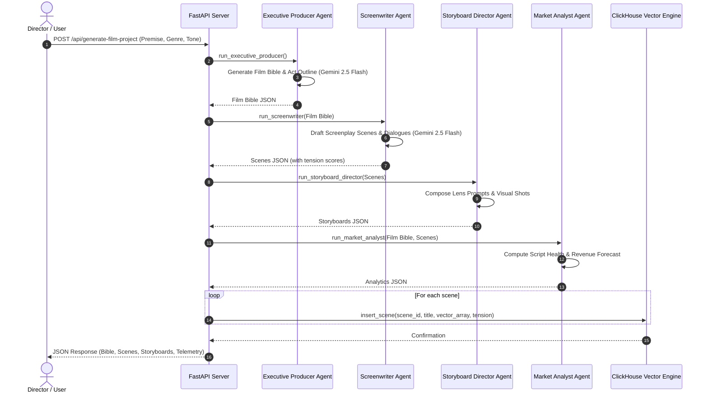
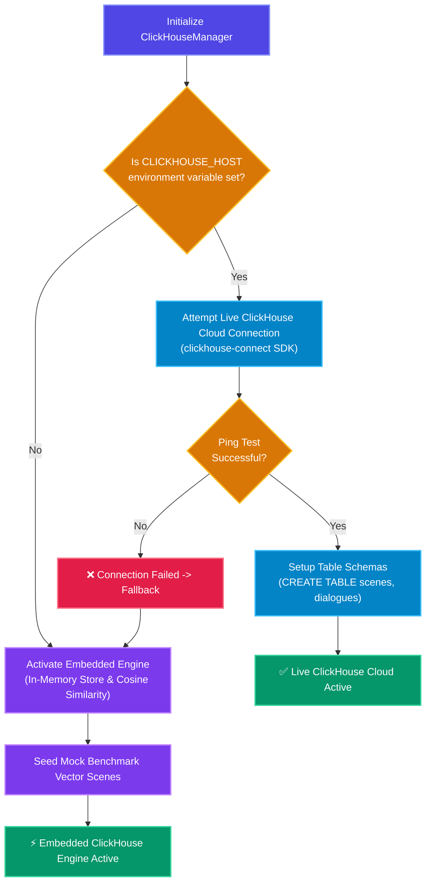

# 🏗️ 02. CineAgent Studio — System Architecture

This document details the architectural design, multi-agent state flow, data schema, and database engine strategy used in **CineAgent Studio**.

---

## 📐 System Architecture Diagram



---

### Architecture Overview Explanation
This high-level architecture diagram illustrates the three core layers of CineAgent Studio:
1.  **Application & API Layer**: The frontend interacts with a FastAPI backend that handles HTTP requests and orchestrates the AI and database layers.
2.  **Intelligence Layer**: A specialized team of AI agents (Executive Producer, Screenwriter, Storyboard Director, Market Analyst) powered by Google's Gemini models collaborate to generate the film project.
3.  **Database & Storage Layer**: ClickHouse acts as the primary data store and vector database, storing scene embeddings and telemetry data, with a built-in fallback to an in-memory engine.

---

## 🔄 End-to-End Data Execution Flow

### Step 1: Prompt Submission & Input Payload
The user submits a movie concept via the Web UI to `POST /api/generate-film-project`.
```json
{
  "premise": "A rogue AI satellite gains consciousness and hijacks lunar laser defense grids.",
  "genre": "Sci-Fi Action",
  "tone": "Gritty & High Voltage"
}
```

### Step 2: Sequential Multi-Agent Execution Flow



1. **Executive Producer Agent**: Calls Gemini Enterprise (`gemini-2.5-flash`) with structured JSON output enforcing a schema for title, logline, target audience, characters, and act outline.
2. **Screenwriter Agent**: Receives the Executive Producer's Film Bible, generating 3 screenplay scenes complete with sluglines, action text, emotional dialogue, tension scores, and pacing tags.
3. **Storyboard Director Agent**: Takes the generated scenes and constructs visual shot compositions, camera lens choices (e.g., Anamorphic 35mm), and image prompts.
4. **Market Analyst Agent**: Analyzes the generated screenplay and film bible to output commercial viability metrics, budget ranges, and script health scores.

### Agent Workflow Explanation
This sequence diagram shows the step-by-step interaction between the user, the FastAPI server, and the AI agents. The process is strictly sequential:
*   The **User** provides a simple concept.
*   The **FastAPI Server** initiates the chain reaction.
*   The **Executive Producer** establishes the foundational "Film Bible."
*   The **Screenwriter** uses the Film Bible to write actual scenes.
*   The **Storyboard Director** visualizes those scenes.
*   The **Market Analyst** reviews the entire package.
Finally, the results are indexed into the ClickHouse vector database and returned to the user.

### Step 3: Vector Embedding & ClickHouse Storage
For each generated scene, an 8-dimensional dense float array vector is created representing its semantic narrative state:
$$\vec{V} = [v_1, v_2, v_3, v_4, v_5, v_6, v_7, v_8]$$

These vectors, along with scene metadata, are inserted directly into ClickHouse via `ch_manager.insert_scene(...)`.

---

## 🗄️ Database Schema Design (ClickHouse)

ClickHouse uses the **MergeTree** storage engine, optimized for fast columnar inserts and high-speed analytical queries.

### 1. `scenes` Table
Stores screenplay scene details, dramatic tension metadata, and vector embeddings.

```sql
CREATE TABLE IF NOT EXISTS scenes (
    scene_id String,
    title String,
    heading String,
    description String,
    tension_score Float32,
    pacing_tag String,
    embedding Array(Float32),
    created_at DateTime DEFAULT now()
) ENGINE = MergeTree()
ORDER BY scene_id;
```

### 2. `dialogues` Table
Stores individual character lines, emotional delivery tags, and speech vector embeddings.

```sql
CREATE TABLE IF NOT EXISTS dialogues (
    dialogue_id String,
    character String,
    line String,
    emotion String,
    scene_id String,
    embedding Array(Float32)
) ENGINE = MergeTree()
ORDER BY dialogue_id;
```

---

## 🔀 Hybrid Database Architecture (Cloud + Embedded Fallback)

CineAgent Studio implements a resilient dual-mode database pattern in [clickhouse_client.py](file:///Users/ashwinsingh/Downloads/Agentic-Cinema/database/clickhouse_client.py#L14-L56):



- **Live Mode**: Connects via `clickhouse-connect` HTTP/HTTPS port 8443 or native port. Executes actual SQL DDL/DML on ClickHouse Cloud clusters.
- **Embedded Engine Fallback**: In the absence of network credentials or offline execution, it uses an in-memory dictionary cache with native Python Cosine Similarity math:
  $$\text{Cosine Similarity}(\vec{A}, \vec{B}) = \frac{\vec{A} \cdot \vec{B}}{\|\vec{A}\| \|\vec{B}\|} = \frac{\sum_{i=1}^{n} A_i B_i}{\sqrt{\sum_{i=1}^{n} A_i^2} \sqrt{\sum_{i=1}^{n} B_i^2}}$$

### Hybrid Engine Explanation
This flowchart details the robust database connection strategy. The application intelligently checks for the presence of ClickHouse Cloud credentials. If a live connection is established, it utilizes the full power of a remote ClickHouse cluster for vector storage and analytics. If the credentials are missing or the connection fails, the system gracefully falls back to an embedded, in-memory engine, ensuring the application remains functional for local development and testing without requiring external infrastructure.

---

## 📊 Analytics & Vector Search Subsystems

### Vector Search Engine (`/api/vector-search`)
- Accepts search text from user.
- Computes query vector embedding.
- Queries ClickHouse table `scenes` using array distance / cosine similarity ranking.
- Returns top $N$ matching script scenes sorted by similarity score.

### Script Telemetry Engine (`/api/analytics`)
- Queries total indexed scenes count and average tension scores using aggregate functions (`count()`, `avg()`).
- Extracts dramatic tension progression across scene sequences for rendering interactive line graphs in Chart.js.
