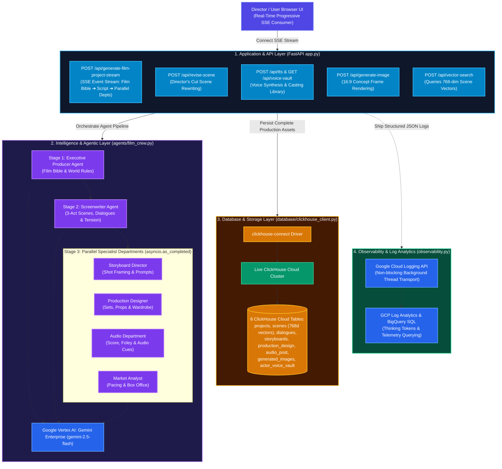
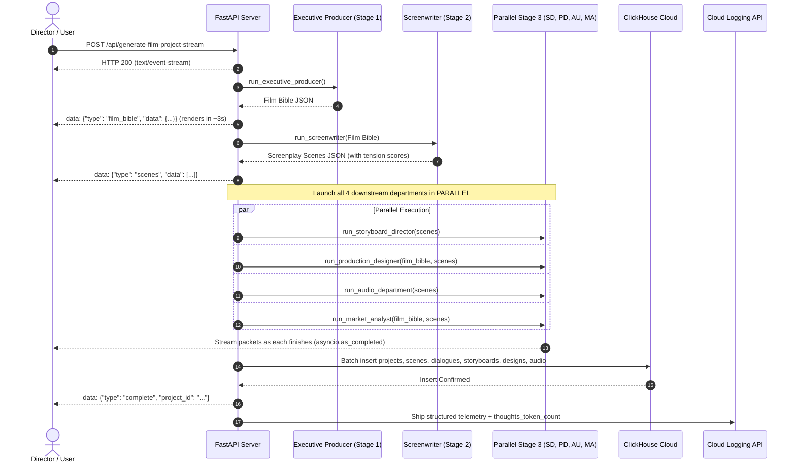

# 🏗️ 02. CineAgent Studio — System Architecture

This document details the architectural design, multi-agent state flow, data schema, and database engine strategy used in **CineAgent Studio**.

---

## 📐 System Architecture Diagram



---

## 🔄 End-to-End Real-Time Streaming Flow



---

## 🗄️ ClickHouse Cloud Schema Design

CineAgent Studio uses **ReplacingMergeTree** tables in ClickHouse Cloud for normalized storage, version updates, and sub-millisecond analytical queries.

### 1. `projects` Table
```sql
CREATE TABLE IF NOT EXISTS projects (
    project_id   String,
    title        String,
    genre        String,
    tone         String,
    logline      String,
    status       String DEFAULT 'active',
    created_at   DateTime DEFAULT now(),
    updated_at   DateTime DEFAULT now()
) ENGINE = ReplacingMergeTree(updated_at)
ORDER BY project_id;
```

### 2. `scenes` Table (768-dim Vector Embeddings)
```sql
CREATE TABLE IF NOT EXISTS scenes (
    scene_id      String,
    project_id    String DEFAULT '',
    title         String,
    heading       String,
    description   String,
    tension_score Float32,
    pacing_tag    String,
    embedding     Array(Float32),
    created_at    DateTime DEFAULT now()
) ENGINE = ReplacingMergeTree(created_at)
ORDER BY scene_id;
```

### 3. `dialogues` Table
```sql
CREATE TABLE IF NOT EXISTS dialogues (
    dialogue_id String,
    project_id  String DEFAULT '',
    scene_id    String,
    character   String,
    line        String,
    emotion     String,
    created_at  DateTime DEFAULT now()
) ENGINE = ReplacingMergeTree(created_at)
ORDER BY (project_id, dialogue_id);
```

### 4. `storyboards` Table
```sql
CREATE TABLE IF NOT EXISTS storyboards (
    storyboard_id String,
    project_id    String,
    scene_id      String DEFAULT '',
    title         String,
    shot_type     String,
    image_prompt  String,
    image_url     String DEFAULT '',
    created_at    DateTime DEFAULT now()
) ENGINE = ReplacingMergeTree(created_at)
ORDER BY (project_id, storyboard_id);
```

### 5. `production_design` Table
```sql
CREATE TABLE IF NOT EXISTS production_design (
    design_id     String,
    project_id    String,
    scene_id      String DEFAULT '',
    set_design    String,
    key_prop      String,
    costume_notes String,
    created_at    DateTime DEFAULT now()
) ENGINE = ReplacingMergeTree(created_at)
ORDER BY (project_id, design_id);
```

### 6. `audio_post` Table
```sql
CREATE TABLE IF NOT EXISTS audio_post (
    audio_id         String,
    project_id       String,
    scene_id         String DEFAULT '',
    soundtrack_theme String,
    foley_effects    String,
    audio_cue        String,
    created_at       DateTime DEFAULT now()
) ENGINE = ReplacingMergeTree(created_at)
ORDER BY (project_id, audio_id);
```

### 7. `generated_images` Table
```sql
CREATE TABLE IF NOT EXISTS generated_images (
    image_id      String,
    project_id    String DEFAULT '',
    storyboard_id String DEFAULT '',
    prompt        String,
    model         String,
    image_url     String,
    created_at    DateTime DEFAULT now()
) ENGINE = ReplacingMergeTree(created_at)
ORDER BY (project_id, image_id);
```

### 8. `actor_voice_vault` & `dialogue_audio` Tables
```sql
CREATE TABLE IF NOT EXISTS actor_voice_vault (
    voice_id         String,
    name             String,
    gender           String,
    accent           String,
    archetype        String,
    voice_type       String DEFAULT 'synthetic',
    sample_text      String,
    sample_audio_url String DEFAULT '',
    gcp_voice_name   String,
    created_at       DateTime DEFAULT now()
) ENGINE = ReplacingMergeTree(created_at)
ORDER BY voice_id;

CREATE TABLE IF NOT EXISTS dialogue_audio (
    audio_id   String,
    project_id String DEFAULT '',
    character  String,
    voice_id   String,
    text       String,
    audio_url  String,
    created_at DateTime DEFAULT now()
) ENGINE = ReplacingMergeTree(created_at)
ORDER BY (project_id, audio_id);
```

---

## 📊 Observability & Model Thinking Telemetry

Every request emitted to Google Cloud Logging includes Gemini 2.5 thinking token metrics:
- **`thoughts_token_count`**: Number of internal reasoning tokens spent before JSON generation.
- **`prompt_token_count`** & **`candidates_token_count`**: Exact input/output token usage.
- **`latency_ms`**: Millisecond-accurate request duration.
- **`request_id`**: Distributed trace ID linking HTTP requests, LLM calls, and ClickHouse operations.
