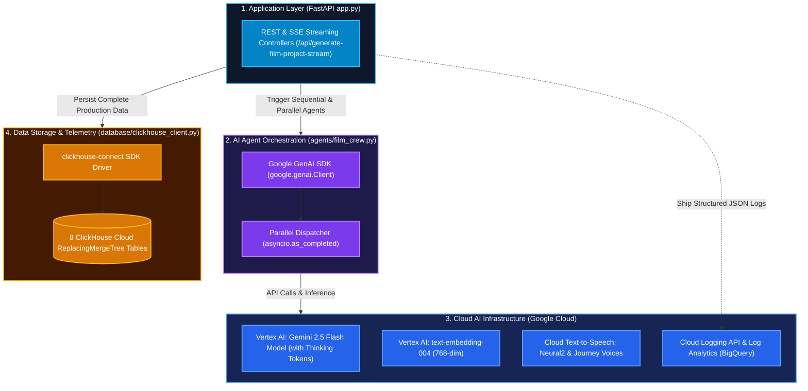

# 🛠️ 03. CineAgent Studio — Technology Stack & Integration

This document outlines the software libraries, frameworks, APIs, and database technologies used in **CineAgent Studio**, detailing how they interface with one another.

---

## 🧰 Full Technology Stack Matrix

| Layer | Technology / Package | Version / Tool | Purpose in CineAgent Studio |
| :--- | :--- | :--- | :--- |
| **Language** | Python | `3.10+` | Core server logic, agent workflows, data orchestration |
| **Web Framework** | FastAPI | `0.110+` | Asynchronous REST API routing, SSE streaming (`StreamingResponse`), OpenAPI docs |
| **ASGI Server** | Uvicorn | `0.28+` | High-performance asynchronous HTTP server with auto-reload |
| **Data Validation** | Pydantic | `v2.6+` | Request/response payload schemas and strict validation |
| **AI Platform** | Google Cloud Vertex AI | Gemini Enterprise | Infrastructure hosting Gemini LLM models and embeddings |
| **AI SDK** | `@google/genai` (`google-genai`) | `0.1.1+` | Official Google GenAI SDK for Gemini Enterprise access |
| **LLM Model** | Gemini 2.5 Flash | `gemini-2.5-flash` | Low-latency multimodal reasoning for screenplay generation & thinking tokens |
| **Embeddings** | Text Embedding 004 | `text-embedding-004` | 768-dimensional dense vector generation for semantic scene search |
| **Speech AI** | Google Cloud TTS | `google-cloud-texttospeech` | Studio-grade Neural2 & Journey synthetic voice actor synthesis |
| **Observability** | Google Cloud Logging | `google-cloud-logging` | Direct background thread log shipping to Cloud Logging & BigQuery Log Analytics |
| **Database** | ClickHouse Cloud | ReplacingMergeTree | Columnar vector database & real-time telemetry analytics across 8 tables |
| **Database Client**| `clickhouse-connect` | `0.7.0+` | Official Python HTTP/TCP driver for ClickHouse |
| **Environment** | `python-dotenv` | `1.0.1+` | Environment configuration management (`.env`) |
| **Frontend UI** | HTML5 / CSS3 / Vanilla JS | Modern ES6+ | Real-time SSE streaming consumer and cinematic dark-mode interface |
| **Data Viz** | Chart.js | `4.x` CDN | Interactive script dramatic tension line charts & pacing curves |

---

## 🔌 System Integration Architecture

---

## 📦 Component Integration Details

### 1. Server-Sent Events (SSE) Streaming (`app.py`)
- Uses FastAPI's `StreamingResponse` with `media_type="text/event-stream"`.
- Yields incremental typed event packets (`agent_start`, `film_bible`, `scenes`, `storyboards`, `production_design`, `audio_post`, `analytics`, `complete`).

### 2. Google GenAI SDK & Thinking Telemetry (`agents/film_crew.py`)
- Instantiates `genai.Client(vertexai=True, project=PROJECT_ID, location="us-central1")`.
- Captures `usage_metadata.thoughts_token_count`, `prompt_token_count`, `candidates_token_count`, and `total_token_count` for granular reasoning analytics.

### 3. ClickHouse Cloud Normalized Persistence (`database/clickhouse_client.py`)
- Batch-inserts rows into 8 tables: `projects`, `scenes`, `dialogues`, `storyboards`, `production_design`, `audio_post`, `generated_images`, and `actor_voice_vault`.
- Excludes temporary fallback SVGs to ensure only real generated concept frames are persisted.

### 4. Direct GCP Cloud Logging API Transport (`observability.py`)
- Uses `google.cloud.logging.handlers.CloudLoggingHandler` with asynchronous `BackgroundThreadTransport`.
- Ensures zero overhead on request latency and enables SQL querying in **GCP Log Analytics**.
