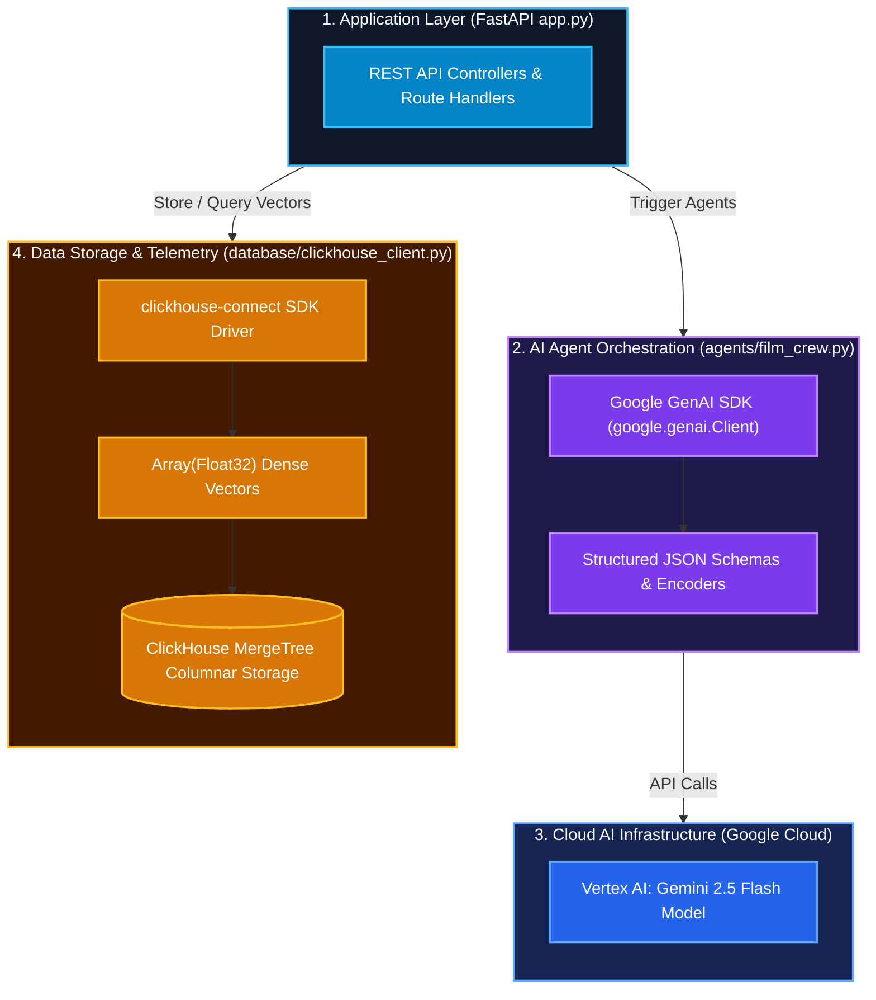

# 🛠️ 03. CineAgent Studio — Technology Stack & Integration

This document outlines the software libraries, frameworks, APIs, and database technologies used in **CineAgent Studio**, detailing how they interface with one another.

---

## 🧰 Full Technology Stack Matrix

| Layer | Technology / Package | Version / Tool | Purpose in CineAgent Studio |
| :--- | :--- | :--- | :--- |
| **Language** | Python | `3.10+` | Core server logic, agent workflows, data orchestration |
| **Web Framework** | FastAPI | `0.115+` | Asynchronous REST API routing, OpenAPI docs, static file serving |
| **ASGI Server** | Uvicorn | `0.34+` | High-performance asynchronous HTTP server |
| **Data Validation** | Pydantic | `v2` | Request/response payload schemas and validation |
| **AI Platform** | Google Cloud Vertex AI | Gemini Enterprise | Infrastructure hosting Gemini LLM models |
| **AI SDK** | `@google/genai` (`google-genai`) | `0.1+` | Official Google GenAI SDK for Gemini Enterprise access |
| **AI Model** | Gemini 2.5 Flash | `gemini-2.5-flash` | Low-latency multimodal reasoning for screenplay generation |
| **Database** | ClickHouse | Cloud / Embedded | Columnar vector database & real-time telemetry analytics |
| **Database Client**| `clickhouse-connect` | `0.8+` | Official Python HTTP/TCP driver for ClickHouse |
| **Environment** | `python-dotenv` | `1.0+` | Environment configuration management (`.env`) |
| **Frontend UI** | HTML5 / CSS3 / Vanilla JS | Modern ES6+ | Dark-mode darkroom studio interface |
| **Data Viz** | Chart.js | `4.x` CDN | Interactive script dramatic tension line charts |

---

## 🔌 System Integration Architecture



---

## 📦 Component Integration Details

### 1. FastAPI + Pydantic Layer (`app.py`)
- FastAPI handles incoming requests from the browser client.
- Pydantic models validate request payloads (`FilmConceptRequest`, `VectorSearchRequest`):
  ```python
  class FilmConceptRequest(BaseModel):
      premise: str
      genre: str = "Sci-Fi Thriller"
      tone: str = "Cinematic & High Tension"
  ```
- Serves static assets (`/static`) including `index.html`, style assets, and JavaScript controllers.

### 2. Google GenAI SDK Integration (`agents/film_crew.py`)
- CineAgent Studio uses the modern official **Google GenAI SDK**:
  ```python
  from google import genai
  from google.genai import types

  client = genai.Client(
      enterprise=True,
      project=PROJECT_ID,
      location="us-central1"
  )
  ```
- **Structured JSON Schema Output**: Prompt configs enforce `response_mime_type="application/json"` to ensure the model responds strictly with clean, parseable JSON arrays and objects without markdown formatting issues.

### 3. ClickHouse Vector Storage Integration (`database/clickhouse_client.py`)
- Connects using `clickhouse-connect`:
  ```python
  import clickhouse_connect

  client = clickhouse_connect.get_client(
      host=CLICKHOUSE_HOST,
      port=CLICKHOUSE_PORT,
      username=CLICKHOUSE_USER,
      password=CLICKHOUSE_PASSWORD,
      secure=True
  )
  ```
- Scenes and dialogues are stored in ClickHouse tables (`scenes`, `dialogues`).
- Embeddings are stored as native `Array(Float32)` columns, allowing for fast analytical aggregations and vector similarity matching.

### 4. Frontend UI & Telemetry Visualization (`static/`)
- A single-page web interface built with vanilla HTML/CSS/JS.
- Integrates **Chart.js** to fetch `/api/analytics` telemetry data and render dynamic dramatic tension line graphs across screenplay acts.
