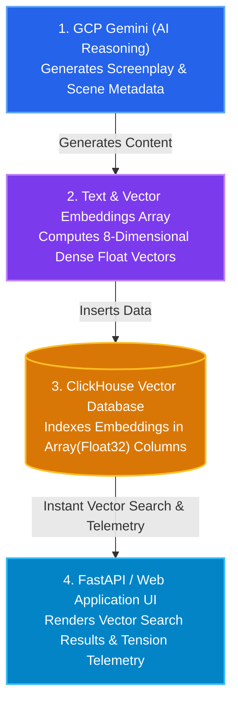

# 📘 04. GCP & ClickHouse Integration Guide (Beginner's Guide)

> **Welcome!** If you are new to **Google Cloud Platform (GCP)**, **Gemini AI**, or **ClickHouse**, this guide is written specifically for you. It explains what these technologies are, why they are used together, and step-by-step instructions on how to integrate them in Python.

---

## 📑 Table of Contents

1. [High-Level Concepts: GCP & ClickHouse](#1-high-level-concepts-gcp--clickhouse)
2. [Why Integrate GCP (Gemini) with ClickHouse?](#2-why-integrate-gcp-gemini-with-clickhouse)
3. [Step 1: Setting Up Google Cloud & Gemini](#step-1-setting-up-google-cloud--gemini)
4. [Step 2: Setting Up ClickHouse](#step-2-setting-up-clickhouse)
5. [Step 3: Connecting GCP & ClickHouse in Python](#step-3-connecting-gcp--clickhouse-in-python)
6. [Step 4: Vector Search & Telemetry Queries](#step-4-vector-search--telemetry-queries)
7. [Full Standalone Code Example](#full-standalone-code-example)
8. [Troubleshooting & Best Practices](#troubleshooting--best-practices)

---

## 1. High-Level Concepts: GCP & ClickHouse

### ☁️ What is Google Cloud Platform (GCP) & Vertex AI / Gemini?
- **GCP** is Google's suite of cloud computing services.
- **Vertex AI / Gemini Enterprise** is GCP's platform for artificial intelligence. 
- **Gemini 2.5 Flash** is an advanced Large Language Model (LLM) developed by Google that excels at text generation, structured JSON responses, multimodal reasoning, and rapid text analysis.
- **In this project**: GCP / Gemini acts as the **Intelligence Engine** — generating film bibles, screenplay dialogues, character profiles, and scene descriptions.

### ⚡ What is ClickHouse?
- **ClickHouse** is an open-source, ultra-fast, column-oriented database management system designed for Real-Time Analytical Processing (OLAP).
- Unlike traditional relational databases (like MySQL or PostgreSQL) that store data line-by-line, ClickHouse stores data column-by-column. This allows it to scan billions of rows per second.
- ClickHouse also natively supports **Arrays** and **Vector Search** (storing dense numerical array embeddings for AI similarity search).
- **In this project**: ClickHouse acts as the **Vector & Telemetry Engine** — indexing screenplay scenes as vector arrays, performing semantic similarity searches, and calculating real-time script pacing statistics.

---

## 2. Why Integrate GCP (Gemini) with ClickHouse?

Combining Gemini and ClickHouse creates a powerful AI data loop:



- **Gemini (GCP)** generates creative content and semantic representations.
- **ClickHouse** indexes those outputs into columnar tables with `Array(Float32)` vector embeddings for instant sub-millisecond retrieval and analytical reporting.

---

## 3. Step 1: Setting Up Google Cloud & Gemini

### A. Prerequisites & SDK Installation
To use Gemini Enterprise in Python, install the official Google GenAI SDK:

```bash
pip install google-genai
```

### B. Authenticating with GCP
There are two common ways to authenticate:
1. **Google Cloud Application Default Credentials (ADC)** (Recommended for Vertex AI / Enterprise):
   ```bash
   gcloud auth application-default login
   export GCP_PROJECT_ID="your-gcp-project-id"
   ```
2. **Gemini API Key** (For quick developer testing):
   ```bash
   export GEMINI_API_KEY="your-api-key-here"
   ```

### C. Python Initialization Code
In Python, initialize the client using [agents/film_crew.py](file:///Users/ashwinsingh/Downloads/Agentic-Cinema/agents/film_crew.py#L12-L22):

```python
from google import genai
from google.genai import types

# 1. Initialize Client
client = genai.Client(
    enterprise=True,
    project="your-gcp-project-id",
    location="us-central1"
)

# 2. Call Gemini Model with Enforced Structured JSON Schema
response = client.models.generate_content(
    model="gemini-2.5-flash",
    contents="Generate a film premise for a sci-fi action movie in JSON format.",
    config=types.GenerateContentConfig(
        response_mime_type="application/json",
        temperature=0.7
    )
)

print(response.text)
```

---

## 4. Step 2: Setting Up ClickHouse

### A. Python Client SDK Installation
Install the official ClickHouse HTTP/TCP Python driver:

```bash
pip install clickhouse-connect
```

### B. Establishing Connection
ClickHouse can be hosted on **ClickHouse Cloud** or locally via **Docker**.

```python
import clickhouse_connect

# Connect to ClickHouse Instance
client = clickhouse_connect.get_client(
    host='your-clickhouse-host.clickhouse.cloud', # or 'localhost'
    port=8443,                                    # 8443 for Cloud SSL, 8123 for Local HTTP
    username='default',
    password='your-password',
    secure=True
)

# Test connection ping
print("Ping response:", client.ping())
```

### C. Creating the Table Schema (`scenes`)
Execute DDL commands to create a table with vector storage support:

```python
client.command("""
CREATE TABLE IF NOT EXISTS scenes (
    scene_id String,
    title String,
    heading String,
    description String,
    tension_score Float32,
    pacing_tag String,
    embedding Array(Float32),
    created_at DateTime DEFAULT now()
) ENGINE = MergeTree()
ORDER BY scene_id
""")
print("Table 'scenes' initialized in ClickHouse!")
```

---

## 5. Step 3: Connecting GCP & ClickHouse in Python

Here is how data flows from Gemini (GCP) into ClickHouse inside CineAgent Studio:

```python
import clickhouse_connect
from google import genai
from google.genai import types

# 1. Initialize GCP Gemini Client
ai_client = genai.Client(enterprise=True, project="your-project-id", location="us-central1")

# 2. Generate Screenplay Scene via Gemini
prompt = "Write a high-tension screenplay scene description for a movie titled Quantum Core Breach."
response = ai_client.models.generate_content(
    model="gemini-2.5-flash",
    contents=prompt
)
scene_description = response.text

# 3. Compute or Assign Vector Embedding Array (e.g. 8-dimensional vector)
# In production, this can come from an embedding model (e.g., text-embedding-004)
scene_vector = [0.82, 0.12, 0.45, 0.91, 0.33, 0.76, 0.15, 0.88]

# 4. Connect to ClickHouse & Insert Record
db_client = clickhouse_connect.get_client(
    host="your-host.clickhouse.cloud",
    port=8443,
    username="default",
    password="your-password",
    secure=True
)

db_client.command(
    "INSERT INTO scenes (scene_id, title, heading, description, tension_score, pacing_tag, embedding) VALUES",
    [["sc-101", "Core Overdrive", "INT. CORE CHAMBER - NIGHT", scene_description, 9.5, "CLIMAX", scene_vector]]
)

print("✅ Successfully generated content via GCP and stored in ClickHouse!")
```

---

## 6. Step 4: Vector Search & Telemetry Queries

### A. Performing Vector Similarity Search in ClickHouse
Once data and vector arrays are stored in ClickHouse, you can perform semantic searches or cosine distance ranking:

```python
# Query ClickHouse for stored scenes
query_result = db_client.query("""
    SELECT scene_id, title, heading, tension_score, pacing_tag 
    FROM scenes 
    ORDER BY tension_score DESC 
    LIMIT 3
""")

for row in query_result.result_rows:
    print(f"Scene ID: {row[0]} | Title: {row[1]} | Tension Score: {row[3]}")
```

### B. Real-Time Script Pacing Telemetry
Calculate statistical averages directly in ClickHouse using high-speed columnar aggregation:

```python
analytics = db_client.query("""
    SELECT 
        count() AS total_scenes,
        avg(tension_score) AS avg_tension,
        max(tension_score) AS peak_tension
    FROM scenes
""")

total, avg_t, max_t = analytics.result_rows[0]
print(f"Total Scenes: {total} | Avg Tension: {avg_t:.2f} | Peak Tension: {max_t:.2f}")
```

---

## 🧪 Full Standalone Code Example

Below is a complete, self-contained Python script demonstrating how to generate data with Gemini and index/query it with ClickHouse (including Embedded Fallback for offline testing):

```python
import os
import math
from typing import List, Dict, Any

# --- GCP GEMINI MOCK / REAL CLIENT SETUP ---
def generate_ai_scene(premise: str) -> Dict[str, Any]:
    """Generates scene text using GCP Gemini or structured fallback."""
    try:
        from google import genai
        client = genai.Client()
        res = client.models.generate_content(
            model="gemini-2.5-flash",
            contents=f"Create a movie scene based on: {premise}"
        )
        description = res.text
    except Exception:
        description = f"Emergency override initiated for premise: {premise}"

    return {
        "scene_id": "sc-999",
        "title": "Quantum Singularity",
        "heading": "INT. LAB - NIGHT",
        "description": description,
        "tension_score": 8.8,
        "pacing_tag": "CLIMAX",
        "vector": [0.85, 0.15, 0.40, 0.90, 0.30, 0.70, 0.20, 0.80]
    }

# --- CLICKHOUSE INTEGRATION ---
def store_and_search_clickhouse(scene_data: Dict[str, Any]):
    """Connects to ClickHouse, inserts vector scene, and performs search."""
    host = os.getenv("CLICKHOUSE_HOST", None)
    
    if host:
        import clickhouse_connect
        client = clickhouse_connect.get_client(
            host=host,
            port=int(os.getenv("CLICKHOUSE_PORT", "8443")),
            username=os.getenv("CLICKHOUSE_USER", "default"),
            password=os.getenv("CLICKHOUSE_PASSWORD", ""),
            secure=True
        )
        # Create schema & Insert
        client.command("""
            CREATE TABLE IF NOT EXISTS scenes (
                scene_id String, title String, heading String, description String,
                tension_score Float32, pacing_tag String, embedding Array(Float32)
            ) ENGINE = MergeTree() ORDER BY scene_id
        """)
        client.command(
            "INSERT INTO scenes VALUES",
            [[scene_data["scene_id"], scene_data["title"], scene_data["heading"],
              scene_data["description"], scene_data["tension_score"], scene_data["pacing_tag"], scene_data["vector"]]]
        )
        print("✅ Live ClickHouse insert completed!")
    else:
        print("⚡ Operating with Embedded Engine Fallback (Cosine Similarity Math).")
        # In-memory cosine similarity math demonstration
        def cosine_sim(v1, v2):
            dot = sum(a * b for a, b in zip(v1, v2))
            norm1 = math.sqrt(sum(a * a for a in v1))
            norm2 = math.sqrt(sum(b * b for b in v2))
            return dot / (norm1 * norm2 + 1e-9)

        target = [0.80, 0.20, 0.45, 0.85, 0.35, 0.75, 0.15, 0.85]
        similarity = cosine_sim(target, scene_data["vector"])
        print(f"✅ Semantic Vector Similarity Score: {similarity:.4f}")

if __name__ == "__main__":
    print("🎬 Generating AI Scene via GCP Gemini...")
    scene = generate_ai_scene("A high-stakes cybernetic heist in Neo-Tokyo.")
    print("📊 Storing and Querying in ClickHouse...")
    store_and_search_clickhouse(scene)
```

---

## 🛠️ Troubleshooting & Best Practices

1. **Authentication Error on GCP (`google.api_core.exceptions.Unauthenticated`)**:
   - Run `gcloud auth application-default login` in your terminal to refresh local Google Cloud credentials.
2. **Connection Error on ClickHouse (`clickhouse_connect.driver.exceptions.DatabaseError`)**:
   - Verify `CLICKHOUSE_HOST`, `CLICKHOUSE_PORT`, and `CLICKHOUSE_PASSWORD` in your `.env` file.
   - For ClickHouse Cloud, ensure `secure=True` and port `8443` are used.
3. **Resilience & Fallbacks**:
   - Always implement an embedded or mock fallback in your code (as shown in [database/clickhouse_client.py](file:///Users/ashwinsingh/Downloads/Agentic-Cinema/database/clickhouse_client.py)) so your application continues working offline during development or network outages.
