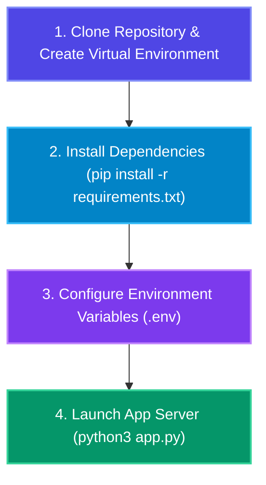

# 🚀 05. Running CineAgent Studio & Gemini Model Configuration Guide

> **This guide explains how to install, configure, and run CineAgent Studio, as well as how to configure Gemini reasoning models, thinking telemetry, and GCP Log Analytics.**

---

## 📑 Table of Contents

1. [Quickstart: How to Run the App](#1-quickstart-how-to-run-the-app)
2. [Environment Configuration (.env)](#2-environment-configuration-env)
3. [Understanding Gemini Models & Thinking Tokens](#3-understanding-gemini-models--thinking-tokens)
4. [Observability & Log Analytics Settings](#4-observability--log-analytics-settings)
5. [How to Change & Upgrade Gemini Models](#5-how-to-change--upgrade-gemini-models)
6. [Troubleshooting & Execution Verification](#6-troubleshooting--execution-verification)

---

## 1. Quickstart: How to Run the App



### Step 1: Open Terminal & Navigate to Project Directory
```bash
cd Agentic-Cinema
```

### Step 2: Create & Activate Virtual Environment (Python 3.13+)
```bash
python3.13 -m venv venv
source venv/bin/activate
```

### Step 3: Install Required Dependencies
```bash
pip install -r requirements.txt
```

### Step 4: Run Automated Tests & Diagnostics
```bash
# Run pytest automated test suite (17 tests)
pytest tests/ -v

# Run environment & MCP verification script
python3 scripts/verify_environment.py
```

### Step 5: Launch the Server
```bash
python3 app.py
```
*(Runs via Uvicorn with auto-reload at `http://localhost:8000`)*

---

## 2. Environment Configuration (.env)

```ini
# --- Google Cloud & Gemini AI Settings ---
GCP_PROJECT_ID=project-2154682a-9280-4a32-a72
GEMINI_MODEL_NAME=gemini-2.5-flash

# --- ClickHouse Cloud Vector Database & Official MCP Settings ---
CLICKHOUSE_HOST=eobvth7u0q.asia-southeast1.gcp.clickhouse.cloud
CLICKHOUSE_USER=default
CLICKHOUSE_PASSWORD=your_password
CLICKHOUSE_PORT=8443
CLICKHOUSE_SECURE=true
CLICKHOUSE_ALLOW_WRITE_ACCESS=true

# --- Production Observability & Log Analytics Settings ---
LOG_LEVEL=INFO
CINEAGENT_LOG_CONTENT=false
CINEAGENT_LOG_CONTENT_MAX_CHARS=2000
```

---

## 3. Understanding Gemini Models & Thinking Tokens

Google Cloud Vertex AI provides several Gemini model tiers:

| Gemini Model Identifier | Capabilities & Strengths | Ideal Use Case in CineAgent |
| :--- | :--- | :--- |
| **`gemini-2.5-flash`** *(Default)* | **Ultra-fast response time**, reasoning capabilities with internal thinking tokens, high throughput. | Real-time SSE streaming & rapid multi-agent generation. |
| **`gemini-2.5-pro`** *(High Reasoning)* | **Highest reasoning capability**, deep narrative planning, complex multi-character dialogues. | Complex feature-length scripts and dense worldbuilding. |
| **`text-embedding-004`** | **768-dimensional dense vector embeddings** for semantic similarity search in ClickHouse. | Vector indexing of scenes, dialogues, and script beats. |

### Thinking Tokens Telemetry
In `gemini-2.5-flash`, the model generates internal chain-of-thought tokens before returning structured JSON. CineAgent Studio automatically captures:
- `thoughts_token_count`: Reasoning tokens spent on narrative structure and JSON schema constraints.
- `prompt_token_count` & `candidates_token_count`: Raw token usage metrics.
- All telemetry is shipped to **Google Cloud Log Analytics** for BigQuery SQL querying.

---

## 4. Observability & Log Analytics Settings

CineAgent Studio features dual-mode log collection:
1. **Local stdout**: Formatted JSON for terminal visibility and Cloud Run native capture.
2. **Direct GCP Cloud Logging Transport**: Transmits structured logs over the network in background worker threads.

To disable direct network log shipping and use stdout only, set:
```bash
export DISABLE_GCP_DIRECT_LOGGING=true
```

---

## 5. How to Change & Upgrade Gemini Models

### Method 1: Environment Variable (No Code Changes Required)
In `.env`:
```ini
GEMINI_MODEL_NAME=gemini-2.5-pro
```
Restart the server:
```bash
python3 app.py
```

### Method 2: Hybrid Per-Agent Model Routing (Advanced)
In [agents/film_crew.py](file:///Users/ashwinsingh/Downloads/Agentic-Cinema/agents/film_crew.py), you can specify different models per agent:
- Executive Producer / Screenwriter ➔ `gemini-2.5-pro` (Creative depth & reasoning).
- Storyboard / Audio / Analyst ➔ `gemini-2.5-flash` (Speed & parallel execution).
