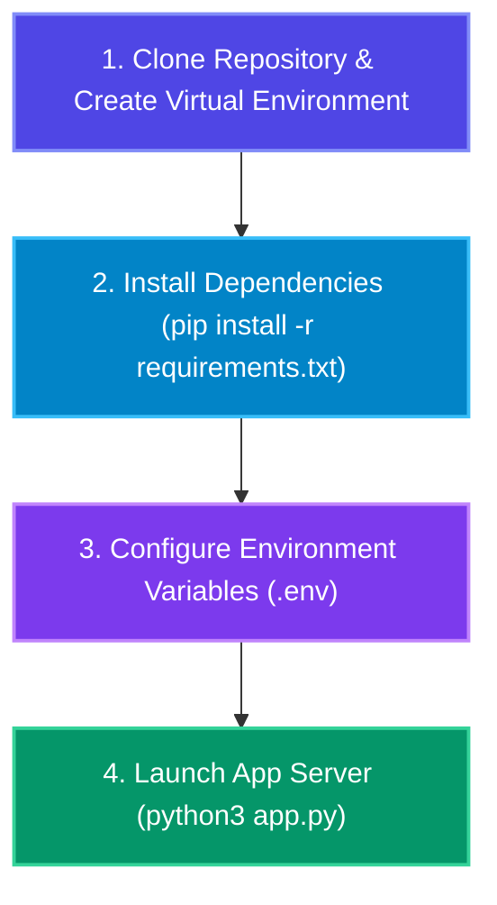

# 🚀 05. Running CineAgent Studio & Gemini Model Configuration Guide

> **This guide explains how to install, configure, and run CineAgent Studio, as well as how to switch or upgrade Google Gemini models in GCP (from `gemini-2.5-flash` to more capable models like `gemini-2.5-pro`).**

---

## 📑 Table of Contents

1. [Quickstart: How to Run the App](#1-quickstart-how-to-run-the-app)
2. [Environment Configuration (.env)](#2-environment-configuration-env)
3. [Understanding Gemini Models in GCP](#3-understanding-gemini-models-in-gcp)
4. [How to Change & Upgrade Gemini Models](#4-how-to-change--upgrade-gemini-models)
   - [Method 1: Using Environment Variable (No Code Edit)](#method-1-using-environment-variable-no-code-edit)
   - [Method 2: Editing agents/film_crew.py Directly](#method-2-editing-agentsfilm_crewpy-directly)
   - [Method 3: Hybrid Per-Agent Model Routing](#method-3-hybrid-per-agent-model-routing-advanced)
5. [Troubleshooting & Execution Verification](#5-troubleshooting--execution-verification)

---

## 1. Quickstart: How to Run the App



### Step 1: Open Terminal & Navigate to Project Directory
```bash
cd Agentic-Cinema
```

### Step 2: Create & Activate Virtual Environment
```bash
python3 -m venv venv
source venv/bin/activate
```

### Step 3: Install Required Dependencies
```bash
pip install -r requirements.txt
```

### Step 4: Launch the Server
```bash
python3 app.py
```
*(Or run via Uvicorn directly: `uvicorn app:app --host 0.0.0.0 --port 8000 --reload`)*

### Step 5: Open Browser
Open your browser and navigate to: **`http://localhost:8000`**

---

## 2. Environment Configuration (.env)

Create a `.env` file in the root project directory (or copy `.env.example`):

```bash
cp .env.example .env
```

### Environment Variable Options:

```ini
# --- Google Cloud & Gemini AI Settings ---
GCP_PROJECT_ID=project-2154682a-9280-4a32-a72
GEMINI_MODEL_NAME=gemini-2.5-flash
# Optional: GEMINI_API_KEY=your_api_key_if_not_using_adc

# --- ClickHouse Vector Database Settings (Optional) ---
# If omitted, embedded ClickHouse vector fallback activates automatically
CLICKHOUSE_HOST=your-instance.clickhouse.cloud
CLICKHOUSE_USER=default
CLICKHOUSE_PASSWORD=your_clickhouse_password
CLICKHOUSE_PORT=8443
CLICKHOUSE_SECURE=true
```

---

## 3. Understanding Gemini Models in GCP

Google Cloud Vertex AI provides several Gemini model tiers designed for different workloads:

| Gemini Model Identifier | Capabilities & Strengths | Ideal Use Case in CineAgent |
| :--- | :--- | :--- |
| **`gemini-2.5-flash`** *(Default)* | **Ultra-fast response time**, highly cost-effective, great for structured JSON generation. | Rapid script generation & rapid prototyping. |
| **`gemini-2.5-pro`** *(Recommended Upgrade)* | **Highest reasoning capability**, superior creative writing, complex narrative planning, deep character dialogues. | Professional feature film scripts & complex multi-act outlines. |
| **`gemini-1.5-pro`** | Massive **2 Million token context window**, deep document reasoning. | Processing full feature-length screenplays (120+ pages). |
| **`gemini-1.5-flash`** | Lightweight, high speed, cost optimized. | High-frequency telemetry or batch vector generation. |

---

## 4. How to Change & Upgrade Gemini Models

### Method 1: Using Environment Variable (No Code Edit)

CineAgent Studio reads the default model name from the `GEMINI_MODEL_NAME` environment variable in [agents/film_crew.py](file:///Users/ashwinsingh/Downloads/Agentic-Cinema/agents/film_crew.py#L31).

To switch to **`gemini-2.5-pro`**, simply set the environment variable before starting the application:

#### On macOS / Linux Terminal:
```bash
export GEMINI_MODEL_NAME="gemini-2.5-pro"
python3 app.py
```

#### Or in `.env` File:
```ini
GEMINI_MODEL_NAME=gemini-2.5-pro
```

---

### Method 2: Editing `agents/film_crew.py` Directly

You can also change the default model directly in the `CineAgentFilmCrew` class constructor inside [agents/film_crew.py](file:///Users/ashwinsingh/Downloads/Agentic-Cinema/agents/film_crew.py#L29-L32):

```python
class CineAgentFilmCrew:
    def __init__(self):
        self.client = get_gemini_client()
        # Change default model here:
        self.model_name = os.getenv("GEMINI_MODEL_NAME", "gemini-2.5-pro")
```

---

### Method 3: Hybrid Per-Agent Model Routing (Advanced)

For optimal performance and quality, you can assign **different Gemini models to different agents** depending on their workload:

```mermaid
flowchart TD
    classDef proStyle fill:#7c3aed,stroke:#c084fc,stroke-width:2px,color:#ffffff;
    classDef flashStyle fill:#0284c7,stroke:#38bdf8,stroke-width:2px,color:#ffffff;

    EP["Executive Producer Agent"]:::proStyle -->|Model: gemini-2.5-pro<br/>(Deep Narrative & Character Bible)| ProModel["Gemini 2.5 Pro"]:::proStyle
    
    SW["Screenwriter Agent"]:::proStyle -->|Model: gemini-2.5-pro<br/>(High-Quality Dialogues & Emotional Cues)| ProModel
    
    SD["Storyboard Director Agent"]:::flashStyle -->|Model: gemini-2.5-flash<br/>(Fast Image Prompt Generation)| FlashModel["Gemini 2.5 Flash"]:::flashStyle
    
    MA["Market Analyst Agent"]:::flashStyle -->|Model: gemini-2.5-flash<br/>(Rapid Analytical Metrics)| FlashModel
```

To implement hybrid per-agent model routing, update the model argument in [agents/film_crew.py](file:///Users/ashwinsingh/Downloads/Agentic-Cinema/agents/film_crew.py):

```python
# Executive Producer (Uses Pro for high creative quality)
response = self.client.models.generate_content(
    model="gemini-2.5-pro",
    contents=prompt,
    config=types.GenerateContentConfig(response_mime_type="application/json")
)

# Screenwriter (Uses Pro for rich dialogue)
response = self.client.models.generate_content(
    model="gemini-2.5-pro",
    contents=prompt,
    config=types.GenerateContentConfig(response_mime_type="application/json")
)

# Storyboard Director (Uses Flash for speed)
response = self.client.models.generate_content(
    model="gemini-2.5-flash",
    contents=prompt
)
```

---

## 5. Troubleshooting & Execution Verification

### Issue 1: `google.genai.errors.APIError: Model not found`
- **Cause**: The model name requested is unavailable in your GCP Vertex AI region.
- **Solution**: Ensure your GCP location is set to `us-central1` or `us-east4` in `agents/film_crew.py`:
  ```python
  client = genai.Client(enterprise=True, project=PROJECT_ID, location="us-central1")
  ```

### Issue 2: Gemini Rate Limit Exceeded (`429 Quota Exceeded`)
- **Cause**: Exceeding requests-per-minute on Pro models.
- **Solution**: Switch back to `gemini-2.5-flash` or add request delay pauses between agent calls.

### Verifying Successful Launch
When the server starts successfully, you will see output similar to:
```
INFO:     Started server process [12345]
INFO:     Waiting for application startup.
INFO:     Application startup complete.
INFO:     Uvicorn running on http://0.0.0.0:8000 (Press CTRL+C to quit)
```
